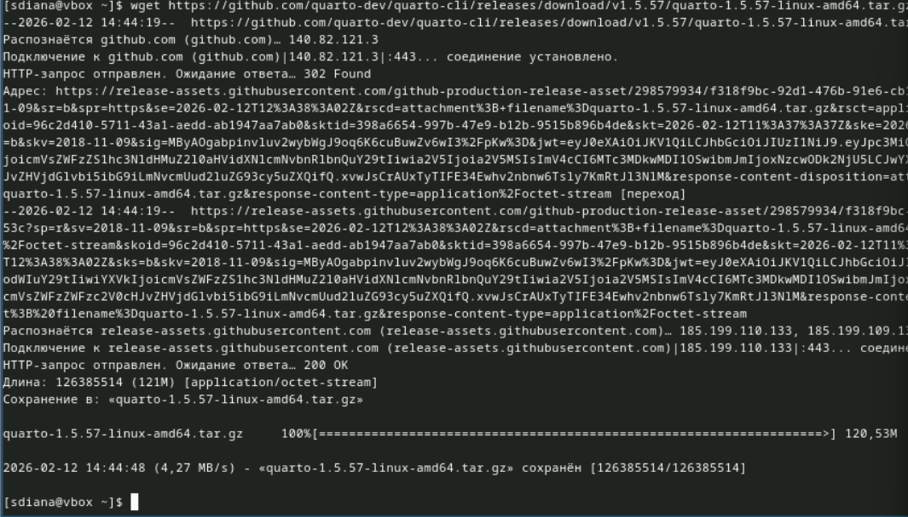
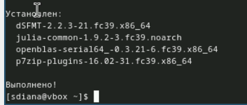
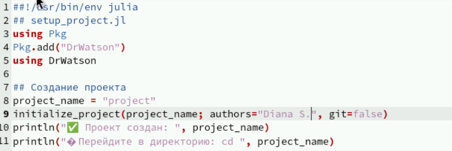
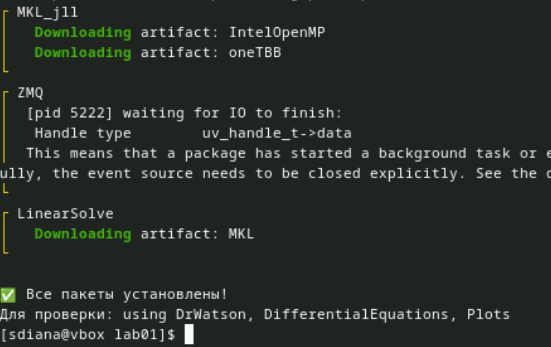
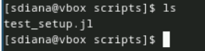
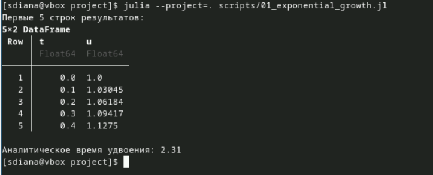
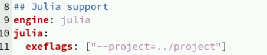
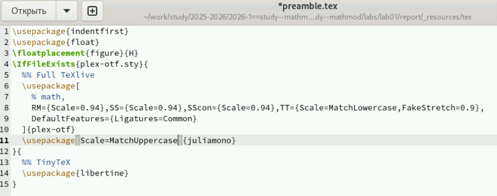
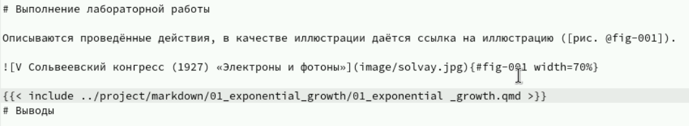

---
## Author
author:
  name: Садова Диана Алексеевна 
  degrees: DSc
  orcid: 0000-0002-0877-7063
  email: 1132239118@rudn.ru
  affiliation:
    - name: Российский университет дружбы народов
      country: Российская Федерация
      postal-code: 117198
      city: Москва
      address: ул. Миклухо-Маклая, д. 6
## Title
title: Математическое моделирование
subtitle: Практикум
license: CC BY
date: today
date-format: "2026-02-21" # Example: 2025-09-06
---

# Информация

## Докладчик

:::::::::::::: {.columns align=center}
::: {.column width="70%"}

  * Садова Диана Алексеевна 
  * студентка 3 курса
  * Российского университета дружбы народов им. П. Лумумбы
  * [1132239118@rudn.ru](mailto:1132239118@rudn.ru)
  * <https://dianasadova.github.io/>

:::
::: {.column width="30%"}

:::
::::::::::::::

# Вводная часть

## Актуальность

- Создание рабочего пространства для дальнейшей работы
- Создание первой программы на julia

## Объект и предмет исследования

- Git
- Julia
- Quarto
- Markdown

## Цели и задачи

- Подготовить рабочее место студента 
- Разобратся с настройкой git и julia
- Подготовить отчет о выполненой работе

## Материалы и методы

- Текст лабороторной работы №1
- Интернет для исправления ошибок

# Создание презентации

## Создать рабочий каталог для всего курса

## Создать рабочее пространство для программ в рамках лабораторной работы.

##

##

## Установить необходимые пакеты

##

##

##

##

##

## Выполнить предложенный код.

- Первый код на julia файл setup_project.jl:

##

- Выполнение 

##

- Код на julia файл add_packages.jl:

##

- Выполнение 

##

- Код на julia файл scripts/test_setup.jl:

##

- Выполнение

## Сгенерировать из литературного кода

- Создаем сам скрипт для модели экспоненциального роста

##

- Выполняем его 

##

- Созаем скрипт для литературной реализации кода 01_exponential_growth.jl

##

- Выполняем его 

##

- Создаем производные форматы 

## Документирование в отчёте

- В каталоге отчёта в файл _quarto.yml включаем поддержку кода julia. 

##

- В преамбуле preamble.tex подключаем пакет juliamono.

##

- В файле отчёта после описания выполнения лабораторной работы подключаем файл описания программы:

##

- Скомпилируем отчёт

## Сгенерировать из литературного кода с параметрами:

- Создаем код 

##

- Выполняем его 

##

- Создаем производные форматы 

## Документирование в отчёте

В каталоге отчёта в файл _quarto.yml включаем поддержку кода julia. 

##

В преамбуле preamble.tex подключаем пакет juliamono.

##

Скомпилируем отчёт

## Результаты

- Смогли настроить рабочую систему для студента на этот семестр, разобрались в работе с git и julia, смогли подготовить отчет о проделанной работе.

