---
## Author
author:
  name: Садова Диана Алексеевна 
  degrees: DSc
  orcid: 0000-0002-0877-7063
  email: 1132239118@rudn.ru
  affiliation:
    - name: Российский университет дружбы народов
      country: Российская Федерация
      postal-code: 117198
      city: Москва
      address: ул. Миклухо-Маклая, д. 6

## Title
title: "Математическое моделирование"
subtitle: "Практикум"
license: "CC BY"
---

# Цель работы

Подготовить рабочее место студента на данный семестор, разобратся с настройкой git и julia на персональном устройстве. Подготовить отчет о выполненой работе. 

# Задание

- Создать рабочий каталог для всего курса.
- Создать рабочее пространство для программ в рамках лабораторной работы.
- Установить необходимые пакеты.
- Выполнить предложенный код.
- Преобразовать код в литературный стиль.
- Сгенерировать из литературного кода:
   - чистый код;
   - jupyter notebook;
   - документацию в формате Quarto.
- Выполнить код из jupyter notebook.
- Интегрировать документацию в формате Quarto в отчёт.
- Добавить в код в литературном стиле вычисление для набора параметров.
- Сгенерировать из литературного кода с параметрами:
   - чистый код;
   - jupyter notebook;
   - документацию в формате Quarto.
- Выполнить код из jupyter notebook с параметрами.
- Интегрировать документацию с параметрами в формате Quarto в отчёт

# Выполнение лабораторной работы

1. Создать рабочий каталог для всего курса. ([рис. @fig-001])

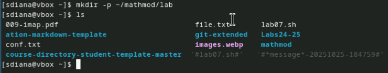{#fig-001 width=90%}

2. Создать рабочее пространство для программ в рамках лабораторной работы. ([рис. @fig-002]),([рис. @fig-003]),([рис. @fig-004]).

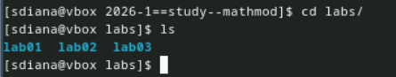{#fig-002 width=90%}

{#fig-003 width=90%}

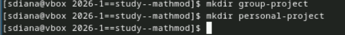{#fig-004 width=90%}

3. Установить необходимые пакеты ([рис. @fig-005]),([рис. @fig-006]),([рис. @fig-007]),([рис. @fig-008]),([рис. @fig-009]),([рис. @fig-012]).

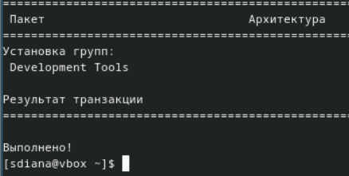{#fig-005 width=90%}

{#fig-006 width=90%}

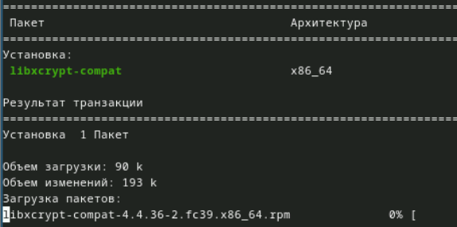{#fig-007 width=90%}

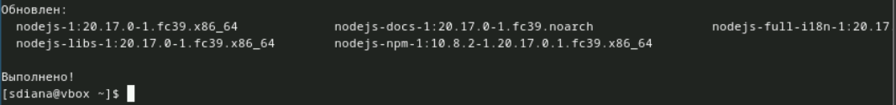{#fig-008 width=90%}

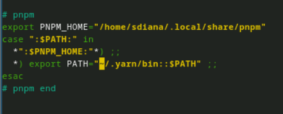{#fig-009 width=90%}

{#fig-012 width=90%}

4. Выполнить предложенный код.

Первый код на julia файл setup_project.jl:([рис. @fig-010])

{#fig-010 width=90%}

Выполнение ([рис. @fig-011])

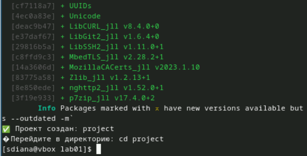{#fig-011 width=90%}

Код на julia файл add_packages.jl:([рис. @fig-013])

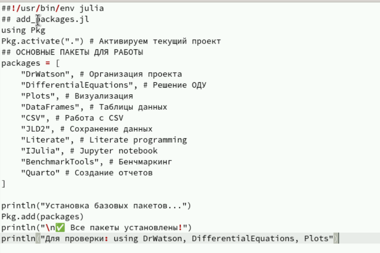{#fig-013 width=90%}

Выполнение ([рис. @fig-014])

{#fig-014 width=90%}

Код на julia файл scripts/test_setup.jl:([рис. @fig-015])

{#fig-015 width=90%}

Выполнение ([рис. @fig-016])

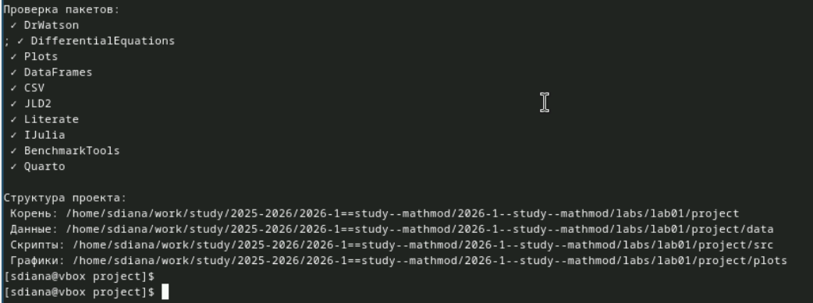{#fig-016 width=90%}

5. Сгенерировать из литературного кода

Создаем сам скрипт для модели экспоненциального роста([рис. @fig-017])

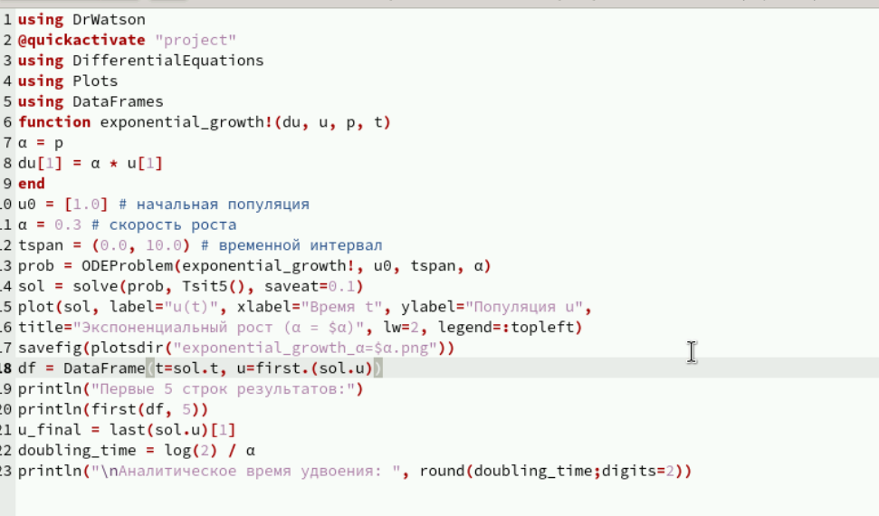{#fig-017 width=90%}

Выполняем его ([рис. @fig-018])

{#fig-018 width=90%}

Созаем скрипт для литературной реализации кода 01_exponential_growth.jl([рис. @fig-019])

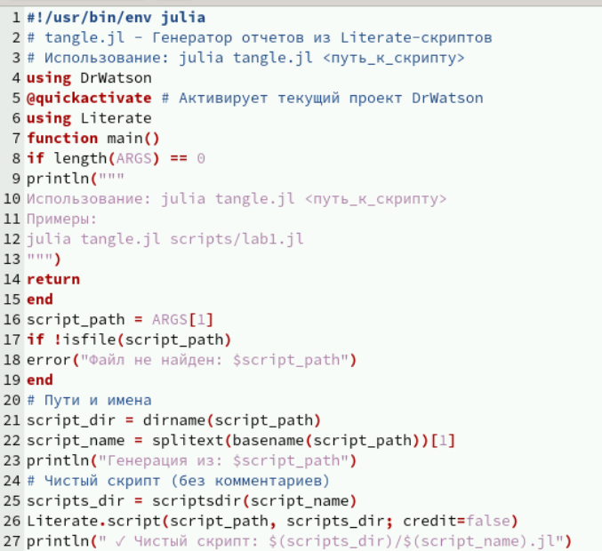{#fig-019 width=90%}

Выполняем его ([рис. @fig-020])

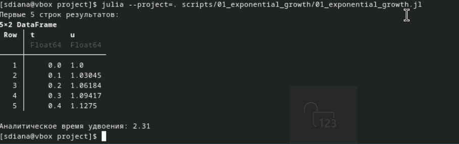{#fig-020 width=90%}

Создаем производные форматы ([рис. @fig-028])

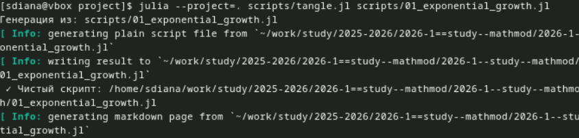{#fig-028 width=90%}

6. Документирование в отчёте

В каталоге отчёта в файл _quarto.yml включаем поддержку кода julia. ([рис. @fig-021])

{#fig-021 width=90%}

В преамбуле preamble.tex подключаем пакет juliamono.([рис. @fig-022])

{#fig-022 width=90%}

В файле отчёта после описания выполнения лабораторной работы подключаем файл описания программы:([рис. @fig-023])

{#fig-023 width=90%}

Скомпилируем отчёт([рис. @fig-024])

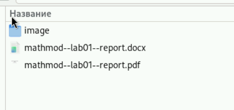{#fig-024 width=90%}

7. Сгенерировать из литературного кода с параметрами:

Создаем код ([рис. @fig-025])

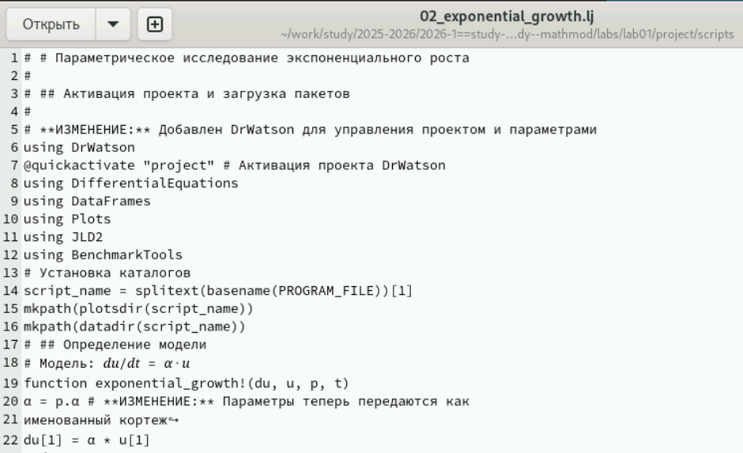{#fig-025 width=90%}

Выполняем его ([рис. @fig-026])

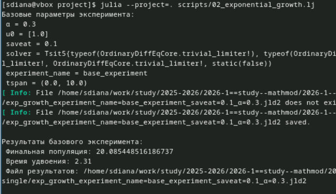{#fig-026 width=90%}

Создаем производные форматы ([рис. @fig-027])

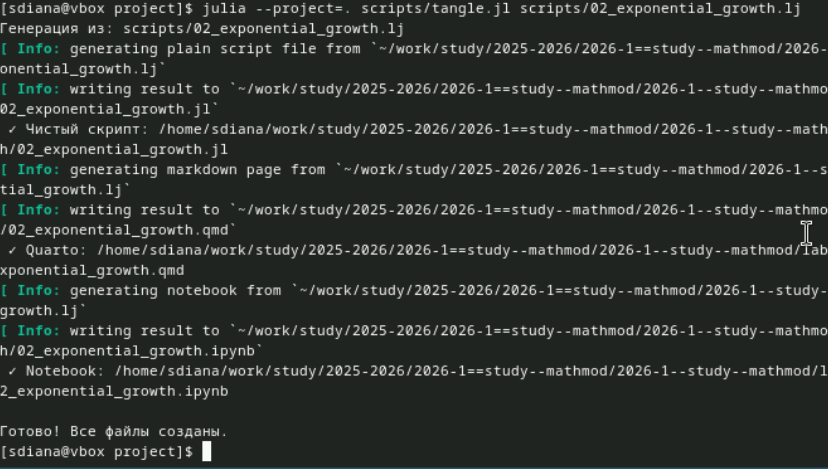{#fig-027 width=90%}

8. Документирование в отчёте

В каталоге отчёта в файл _quarto.yml включаем поддержку кода julia. ([рис. @fig-029])

{#fig-029 width=90%}

В преамбуле preamble.tex подключаем пакет juliamono.([рис. @fig-030])

{#fig-030 width=90%}

Скомпилируем отчёт([рис. @fig-031])

{#fig-031 width=90%}

# Выводы

Смогли настроить рабочую систему для студента на этот семестр, разобрались в работе с git и julia, смогли подготовить отчет о проделанной работе.

# Список литературы{.unnumbered}

::: {#refs}
:::
