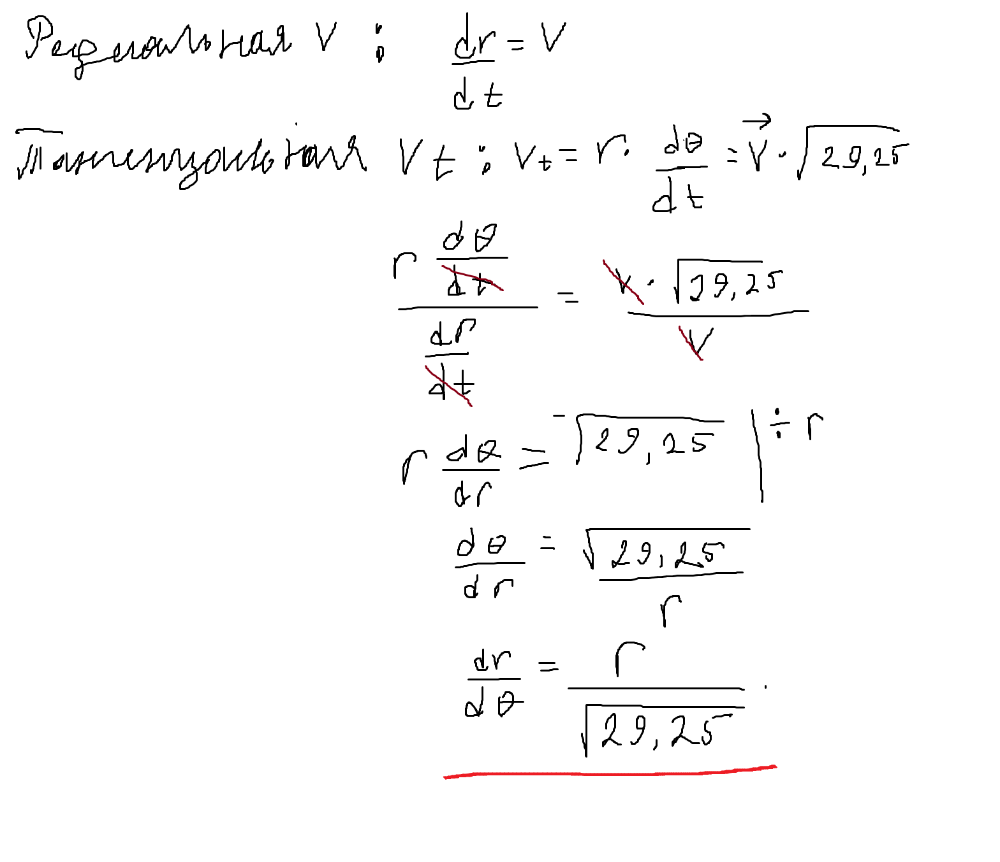
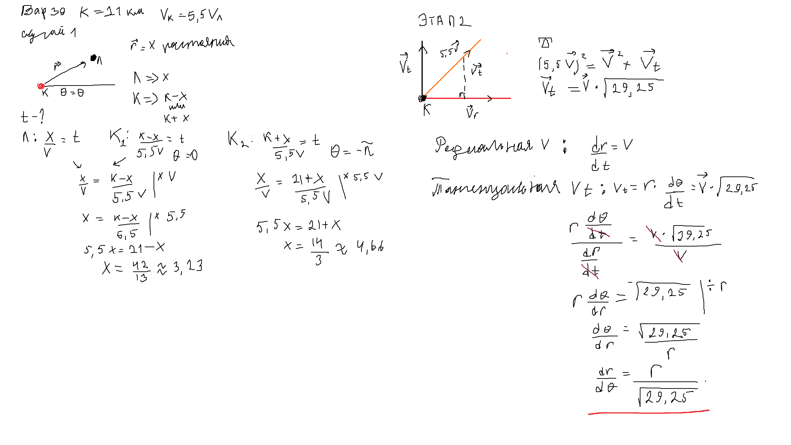
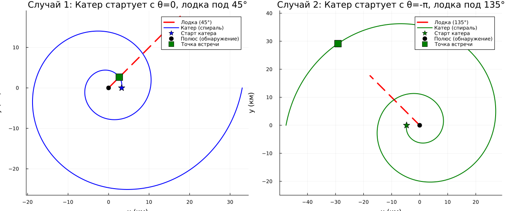

---
## Author
author:
  name: Садова Диана Алексеевна 
  degrees: DSc
  orcid: 0000-0002-0877-7063
  email: 1132239118@rudn.ru
  affiliation:
    - name: Российский университет дружбы народов
      country: Российская Федерация
      postal-code: 117198
      city: Москва
      address: ул. Миклухо-Маклая, д. 6
## Title
title: Задача о погоне
subtitle: Лабораторная работа
license: CC BY
date: today
date-format: "2026-03-07" # Example: 2025-09-06
---

# Информация

## Докладчик

:::::::::::::: {.columns align=center}
::: {.column width="70%"}

Садова Диана Алексеевна 

студентка 3 курса

Российского университета дружбы народов им. П. Лумумбы

[1132239118@rudn.ru](mailto:1132239118@rudn.ru)

<https://dianasadova.github.io/>

:::
::: {.column width="30%"}

:::
::::::::::::::

# Вводная часть

## Актуальность

- Возможность потренироватся в написании кода на julia 

## Цели и задачи

- Решить математрическую задачу и приведем пример построения математических моделей для выбора правильной стратегии при решении задач поиска

## Материалы и методы

Текст лабороторной работы №2

Интернет для исправления ошибок 

# Задание

 

## Вариант 39

На море в тумане катер береговой охраны преследует лодку браконьеров. Через определенный промежуток времени туман рассеивается, и лодка обнаруживается на расстоянии 21 км от катера. Затем лодка снова скрывается в тумане и уходит прямолинейно в неизвестном направлении. Известно, что скорость катера в 5,5 раза больше скорости браконьерской лодки.

##

1. Запишите уравнение, описывающее движение катера, с начальными условиями для двух случаев (в зависимости от расположения катера относительно лодки в начальный момент времени).

2. Постройте траекторию движения катера и лодки для двух случаев.

3. Найдите точку пересечения траектории катера и лодки

# Выполнение лабораторной работы

Данную задачу нужно решить в 2 этапа: нахождение радиуса (r) и находение траектории движения (dr/dO).

Начнем с первого этапа 

##

##

Рисуем мини график, как у нас должен двигатся катер

Определяем что мы ищем. На данном шаге мы ищем растояние (x). Определяем что растояние x это вектор двидения радиуса. Получим 3 уравнения для нахождения времени: 

##

Получаем ответ: x = 3,23.

##

Этап два. Находим траекторию движения катера в полярных координатах 

##

##

Начинаем с рисования графика, где скорость (vt), является катетом прямоугольного треугольника. П

онимаем что это прямоугольный преугольник и решаем с помощью теоремы Пифогара. 

Находим vt. 

Далее нам нужно будет использовать две формулы: тангенциальная скорость и радиальная скорость. 

##

##

Радиальная скорость - это скорость, с которой катер удаляется от полюса.

Тангенциальная скорость – это линейная скорость вращения катера относительно полюса.

Находим уравнение для нахождения траектории движения. 

##

В итоге у меня получилось такое решение 

##

# Результаты кода 

# Результаты

У нас получилось решить задачу и построить математическую модель.
