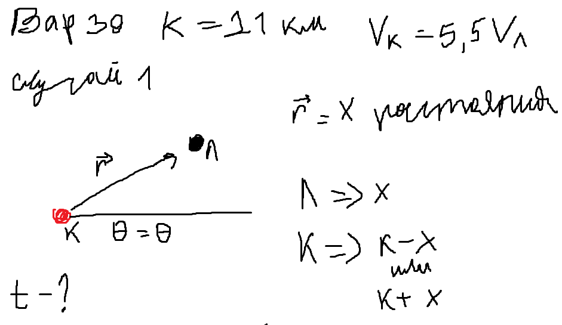
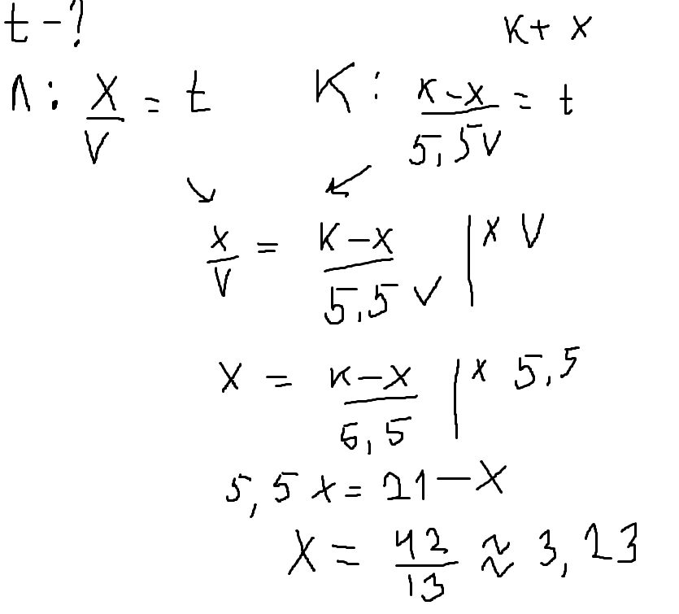
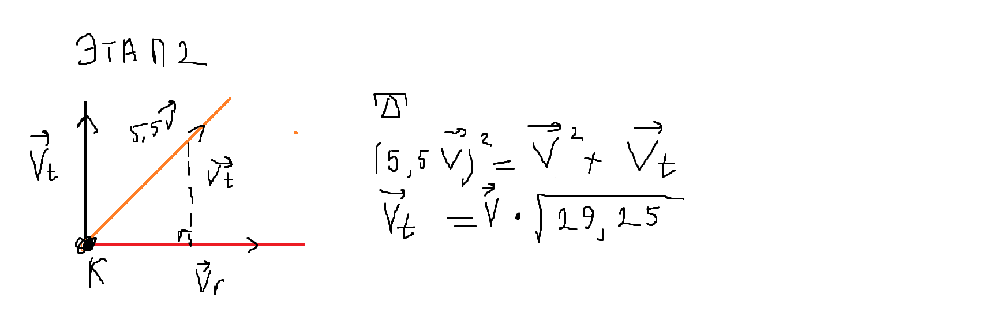

---
## Author
author:
  name: Садова Диана Алексеевна 
  degrees: DSc
  orcid: 0000-0002-0877-7063
  email: 1132239118@rudn.ru
  affiliation:
    - name: Российский университет дружбы народов
      country: Российская Федерация
      postal-code: 117198
      city: Москва
      address: ул. Миклухо-Маклая, д. 6

## Title
title: "Задача о погоне"
subtitle: "Лабораторная работа"
license: "CC BY"
---

# Цель работы

Решить математрическую задачу и приведем пример построения математических моделей для выбора правильной стратегии при решении задач поиска

# Задание

Вариант 39. 

На море в тумане катер береговой охраны преследует лодку браконьеров. Через определенный промежуток времени туман рассеивается, и лодка обнаруживается на расстоянии 21 км от катера. Затем лодка снова скрывается в тумане и уходит прямолинейно в неизвестном направлении. Известно, что скорость катера в 5,5 раза больше скорости браконьерской лодки.

1. Запишите уравнение, описывающее движение катера, с начальными условиями для двух случаев (в зависимости от расположения катера относительно лодки в начальный момент времени).

2. Постройте траекторию движения катера и лодки для двух случаев.

3. Найдите точку пересечения траектории катера и лодки

# Выполнение лабораторной работы

Данную задачу нужно решить в 2 этапа: нахождение радиуса (r) и находение траектории движения (dr/dO).

Начнем с первого этапа ([рис. @fig-001]).

{#fig-001 width=90%}

Рисуем мини график, как у нас должен двигатся катер

Определяем что мы ищем. На данном шаге мы ищем растояние (x). Определяем что растояние x это вектор двидения радиуса. Получим 3 уравнения для нахождения времени: ([рис. @fig-002]).

{#fig-002 width=90%}

Получаем ответ: x = 3,23.

Этап два. Находим траекторию движения катера в полярных координатах ([рис. @fig-003]).

{#fig-003 width=90%}

Начинаем с рисования графика, где скорость (vt), является катетом прямоугольного треугольника. Понимаем что это прямоугольный преугольник и решаем с помощью теоремы Пифогара. Находим vt. 

Далее нам нужно будет использовать две формулы: тангенциальная скорость и радиальная скорость. ([рис. @fig-004]).

{#fig-004 width=90%}

Радиальная скорость - это скорость, с которой катер удаляется от полюса.

Тангенциальная скорость – это линейная скорость вращения катера относительно полюса.

Находим уравнение для нахождения траектории движения. 

В итоге у меня получилось такое решение ([рис. @fig-005]).

{#fig-00 width=90%}

# Код 



# Выводы

У нас получилось решить задачу и построить математическую модель.

# Список литературы{.unnumbered}

::: {#refs}
:::
