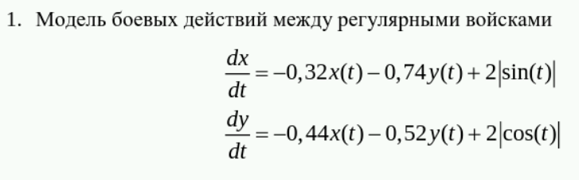
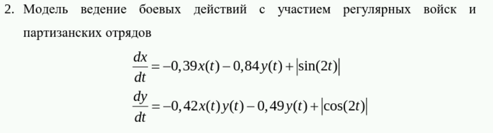
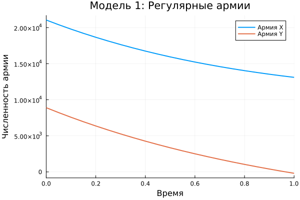
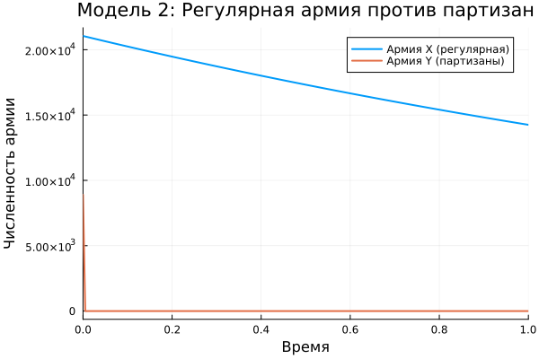

---
## Author
author:
  name: Садова Диана Алексеевна 
  degrees: DSc
  orcid: 0000-0002-0877-7063
  email: 1132239118@rudn.ru
  affiliation:
    - name: Российский университет дружбы народов
      country: Российская Федерация
      postal-code: 117198
      city: Москва
      address: ул. Миклухо-Маклая, д. 6
## Title
title: Модель боевых действий
subtitle: Лабораторная работа
license: CC BY
date: today
date-format: "2026-03-17" # Example: 2025-09-06
---

# Информация

## Докладчик

:::::::::::::: {.columns align=center}
::: {.column width="70%"}

Садова Диана Алексеевна 

студентка 3 курса

Российского университета дружбы народов им. П. Лумумбы

[1132239118@rudn.ru](mailto:1132239118@rudn.ru)

<https://dianasadova.github.io/>

:::
::: {.column width="30%"}


:::
::::::::::::::

# Вводная часть

## Актуальность

- Тренировка в создании математических моделей 

## Цели и задачи

Решить математрическую задачу 

Приведем пример построения математических моделей для анализа изменения численности войск армии Х и армии У. 

## Материалы и методы

Текст лабороторной работы №3

Интернет для исправления ошибок 

# Модель боевых действий

## Вариант 39

Между страной Х и страной У идет война. Численность состава войск исчисляется от начала войны, и являются временными функциями x(t) и y(t) . В начальный момент времени страна Х имеет армию численностью 21 050 человек, а в распоряжении страны У армия численностью в 8 900 человек. Для упрощения модели считаем, что коэффициенты a, b, c, h постоянны. Также считаем P(t) и Q(t) непрерывные функции.


## Построение графики

Постройте графики изменения численности войск армии Х и армии У для следующих случаев:

## Для первого случая 



## Для второго случая 



## Код

Параметры:

```yaml

x0 = 21050
y0 = 8900
t0 = 0
tmax = 1
dt = 0.05
du = 0
u = 0
p = 0
t =0

```
## Модель боевых действий между регулярными войсками

```make

function model1!(du, u, p, t)

    x = u[1]
    y = u[2]

    du[1] = -0.32*x - 0.74*y + 2 + sin(t)   # изменение армии X
    du[2] = -0.44*x - 0.52*y + 2 + cos(t)   # изменение армии Y
end

```

## Модель ведение боевых действий с участием регулярных войск и партизанских отрядов

```make

function model2!(du, u, p, t)

    x = u[1]
    y = u[2]

    du[1] = -0.39*x - 0.84*y + sin(2*t)        # регулярная армия
    du[2] = -0.42*x*y - 0.49*y + cos(2*t)      # партизанские отряды
end

```

## Модель ведение боевых действий с участием партизанских отрядов и партизанских отрядов

```make

function model3!(du, u, p, t)

    x = u[1]
    y = u[2]

    a = 0.25     # потери армии X не связанные с боем
    b = 0.33     # эффективность армии Y (взаимодействие)
    c = 0.28     # эффективность армии X (взаимодействие)
    h = 0.47     # потери армии Y не связанные с боем

    P = 2.5
    Q = 1.5

    du[1] = -a*x - b*x*y + P
    du[2] = -h*y - c*x*y + Q
end

```


## Результаты кода 



##



##


## Результаты

У нас получилось решить задачу и построить математическую модель. У нас получилось, что в любом случае побеждает армия X.


