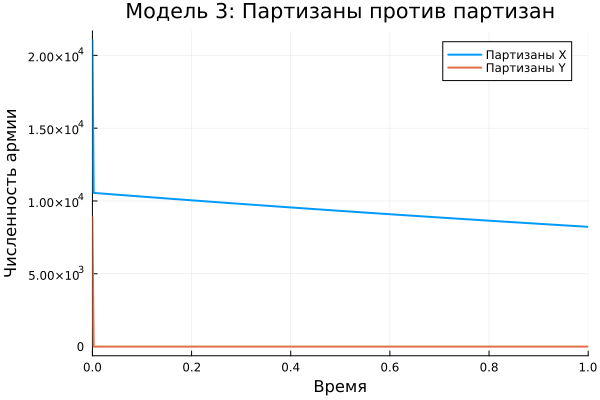

---
## Author
author:
  name: Садова Диана Алексеевна 
  degrees: DSc
  orcid: 0000-0002-0877-7063
  email: 1132239118@rudn.ru
  affiliation:
    - name: Российский университет дружбы народов
      country: Российская Федерация
      postal-code: 117198
      city: Москва
      address: ул. Миклухо-Маклая, д. 6

## Title
title: "Модель боевых действий"
subtitle: "Лабораторная работа"
license: "CC BY"
---

# Цель работы

Решить математрическую задачу и приведем пример построения математических моделей для анализа изменения численности войск армии Х и армии У. 

# Задание

Между страной Х и страной У идет война. Численность состава войск исчисляется от начала войны, и являются временными функциями x(t) и y(t) . В начальный момент времени страна Х имеет армию численностью 21 050 человек, а в распоряжении страны У армия численностью в 8 900 человек. Для упрощения модели считаем, что коэффициенты a, b, c, h постоянны. Также считаем P(t) и Q(t) непрерывные функции.

Постройте графики изменения численности войск армии Х и армии У для следующих случаев:

Для первого случая ([рис. @fig-001]).

{#fig-001 width=90%}

Для второго случая ([рис. @fig-002]).

{#fig-002 width=90%}

# Выполнение лабораторной работы



([рис. @fig-003]).

{#fig-003 width=90%}

([рис. @fig-004]).

{#fig-004 width=90%}

([рис. @fig-005]).

{#fig-005 width=90%}

# Выводы

У нас получилось решить задачу и построить математическую модель. У нас получилось, что в любом случае побеждает армия X.

# Список литературы{.unnumbered}

::: {#refs}
:::
