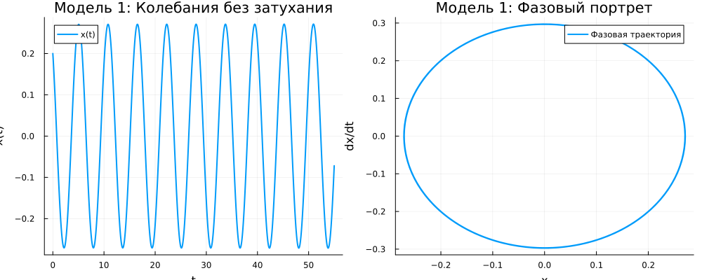
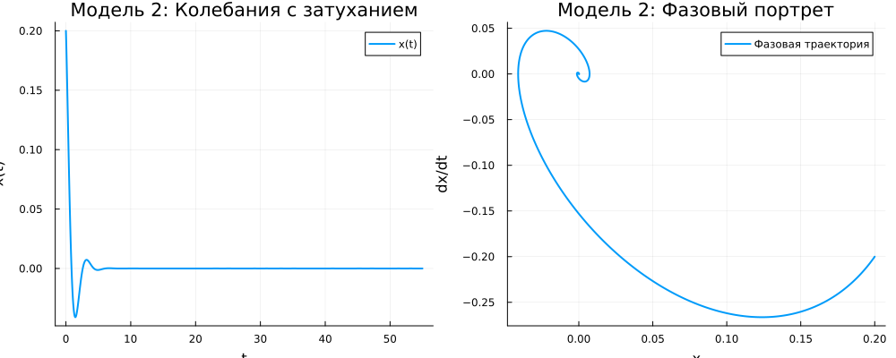
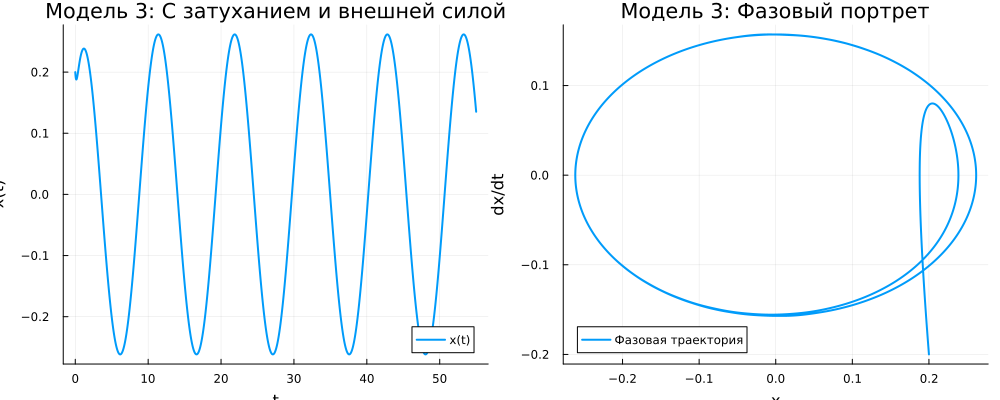
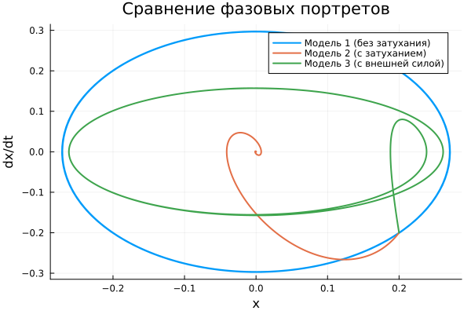
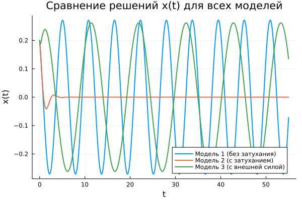

---
## Author
author:
  name: Садова Диана Алексеевна 
  degrees: DSc
  orcid: 0000-0002-0877-7063
  email: 1132239118@rudn.ru
  affiliation:
    - name: Российский университет дружбы народов
      country: Российская Федерация
      postal-code: 117198
      city: Москва
      address: ул. Миклухо-Маклая, д. 6
## Title
title: Модель гармонических колебаний
subtitle: Лабораторная работа
license: CC BY
date: today
date-format: "2026-02-04" # Example: 2025-09-06
---

# Информация

## Докладчик

:::::::::::::: {.columns align=center}
::: {.column width="70%"}

Садова Диана Алексеевна 

студентка 3 курса

Российского университета дружбы народов им. П. Лумумбы

[1132239118@rudn.ru](mailto:1132239118@rudn.ru)

<https://dianasadova.github.io/>

:::
::: {.column width="30%"}


:::
::::::::::::::

# Вводная часть

## Актуальность

- Тренировка в создании математических моделей 

## Цели и задачи

*1.* Решить уравнение гармонических колебаний 

*2.* Построяит фазовый портрет гармонического осциллятора.

## Материалы и методы

Текст лабороторной работы №4

Интернет для исправления ошибок 

# Модель гармонических колебаний

## Вариант 39

Построяит фазовый портрет гармонического осциллятора и решение уравнения гармонического осциллятора для следующих случаев: 

*1.* Колебания гармонического осциллятора без затуханий и без действий внешней силы. 

*2.* Колебания гармонического осциллятора c затуханием и без действий внешней силы. 

*3.* Колебания гармонического осциллятора c затуханием и под действием внешней силы. 

На интервале [0,55], шаг - 0.05 с начальными условиями x0 = 0.2, y0 = -0.2


## Колебания гармонического осциллятора без затуханий и без действий внешней силы

```yaml
function model1!(du, u, p, t)
    du[1] = u[2]
    du[2] = -1.2 * u[1]
end
```

## 



## Колебания гармонического осциллятора c затуханием и без действий внешней силы


```yaml
function model2!(du, u, p, t)
    du[1] = u[2]
    du[2] = -4.3 * u[1] - 2.0 * u[2]
end
```

## 



## Колебания гармонического осциллятора c затуханием и под действием внешней силы

```make

function model3!(du, u, p, t)
    du[1] = u[2]
    du[2] = -7.5 * u[1] - 7.4 * u[2] + 2.2 * cos(0.6 * t)
end

```

##




## Результаты кода 



##



## Результаты

Решили уравнение гармонических колебаний и построяли фазовый портрет гармонического осциллятора.


