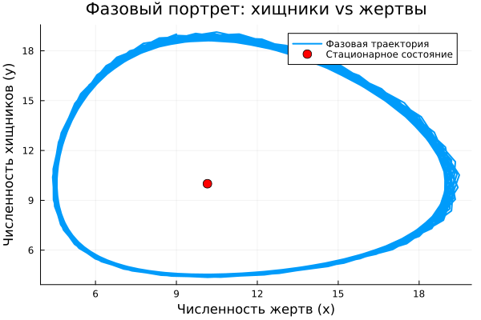

---
## Author
author:
  name: Садова Диана Алексеевна 
  degrees: DSc
  orcid: 0000-0002-0877-7063
  email: 1132239118@rudn.ru
  affiliation:
    - name: Российский университет дружбы народов
      country: Российская Федерация
      postal-code: 117198
      city: Москва
      address: ул. Миклухо-Маклая, д. 6
## Title
title: Модель хищник-жертва
subtitle: Лабораторная работа №5
license: CC BY
date: today
date-format: "2026-03-17" # Example: 2025-09-06
---

# Информация

## Докладчик

:::::::::::::: {.columns align=center}
::: {.column width="70%"}

Садова Диана Алексеевна 

студентка 3 курса

Российского университета дружбы народов им. П. Лумумбы

[1132239118@rudn.ru](mailto:1132239118@rudn.ru)

<https://dianasadova.github.io/>

:::
::: {.column width="30%"}


:::
::::::::::::::

# Вводная часть

## Актуальность

- Тренировка в создании математических моделей 

## Цели и задачи

Построить простейшую модель взаимодействия двух видов типа «хищник — жертва» - модель Лотки-Вольтерры. 

## Материалы и методы

Текст лабороторной работы №5

Интернет для исправления ошибок 

# Модель хищник-жертва

## Вариант 39

Для модели «хищник-жертва»


##

Постройте график зависимости численности хищников от численности жертв, а также графики изменения численности хищников и численности жертв при следующих начальных условия: x0 = 9, y0 = 19. Найдите стационарное состояние системы.

## Код

Параметры:

```yaml

x0 = 9
y0 = 19
a = 0.67
b = 0.067
c = 0.66
d = 0.065

dt = 0.5

t = (0, 200)
```
## Модель хищник-жертва

```make

function model1!(du, u, p, t)
    x, y = u
    du[1] = a*x - b*x*y
    du[2] = -c*y + d*x*y
end

```

## Результаты кода 


##

{#fig-003 width=90%}


## Результаты

У нас получилось построять простейшую модель взаимодействия двух видов типа «хищник — жертва»
