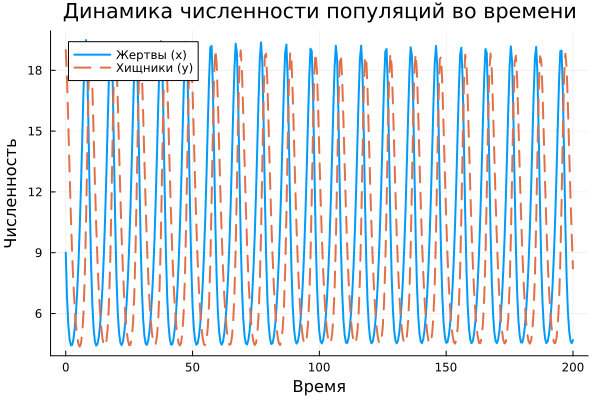

---
## Author
author:
  name: Садова Диана Алексеевна 
  degrees: DSc
  orcid: 0000-0002-0877-7063
  email: 1132239118@rudn.ru
  affiliation:
    - name: Российский университет дружбы народов
      country: Российская Федерация
      postal-code: 117198
      city: Москва
      address: ул. Миклухо-Маклая, д. 6

## Title
title: "Модель хищник-жертва"
subtitle: "Лабораторная работа №5"
license: "CC BY"
---

# Цель работы

Построить простейшую модель взаимодействия двух видов типа «хищник — жертва» - модель Лотки-Вольтерры. 

# Задание

Для модели «хищник-жертва»([рис. @fig-001]).

{#fig-001 width=90%}

Постройте график зависимости численности хищников от численности жертв, а также графики изменения численности хищников и численности жертв при следующих начальных условия: x0 = 9, y0 = 19. Найдите стационарное состояние системы.

# Выполнение лабораторной работы

```{julia}
using Plots
using DifferentialEquations
using LinearAlgebra
```

======================
ПАРАМЕТРЫ ЗАДАЧИ
======================

```{julia}
x0 = 9
y0 = 19
a = 0.67
b = 0.067
c = 0.66
d = 0.065

dt = 0.5

println("Параметры задачи:")
println("  X₀ = $x0")
println("  Y₀ = $y0")
println("  Коэффициент естественной смертности хищников = $a")
println("  Коэффициент естественного прироста жертв  = $b")
println("  Коэффициент увеличения числа хищников = $c")
println("  Коэффициент смертности жертв = $d")

println("  Шаг = $dt")
```

интервал времени моделирования

```{julia}
t = (0, 200)


println("  Интервал времени моделирования = $t")
```


1 МОДЕЛЬ - «хищник-жертва»


```{julia}
function model1!(du, u, p, t)
    x, y = u
    du[1] = a*x - b*x*y
    du[2] = -c*y + d*x*y
end

mkpath("plots")

u0 = [x0, y0]
```

создаём задачу для решения системы ОДУ

```{julia}
prob1 = ODEProblem(model1!, u0, t)
```

численно решаем систему

```{julia}
sol1 = solve(prob1, Tsit5(), saveat=dt)
```

Извлечение данных

```{julia}
t = sol1.t
x = sol1[1,:]
y = sol1[2,:]

```


АНАЛИЗ РЕЗУЛЬТАТОВ


```{julia}
println("\n" * "="^50)
println("РЕЗУЛЬТАТЫ МОДЕЛИРОВАНИЯ")
println("="^50)

println("Стационарное состояние:")
println("x0 = ", 0.66/0.065, " (жертвы)")
println("y0 = ", 0.67/0.067, " (хищники)")

println("\nПрограмма завершена!")
```

Получившийся результат([рис. @fig-002]), ([рис. @fig-003]).

{#fig-002 width=90%}

{#fig-003 width=90%}

# Выводы

Построили простейшую модель взаимодействия двух видов типа «хищник — жертва» - модель Лотки-Вольтерры. 

# Список литературы{.unnumbered}

::: {#refs}
:::
