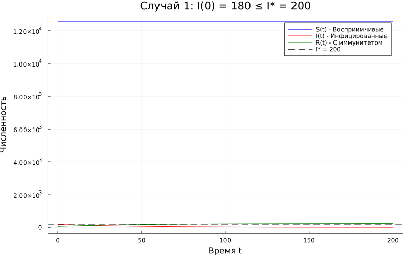
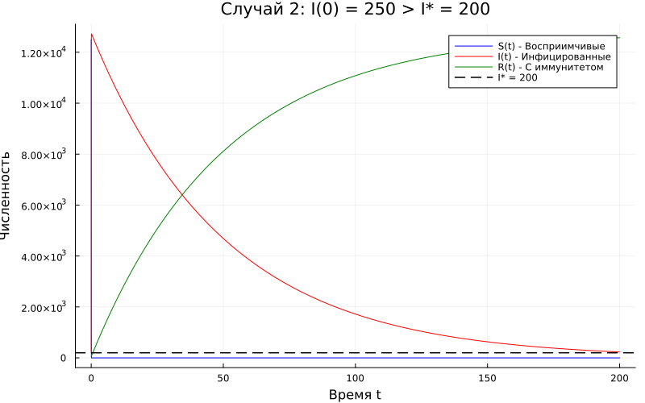
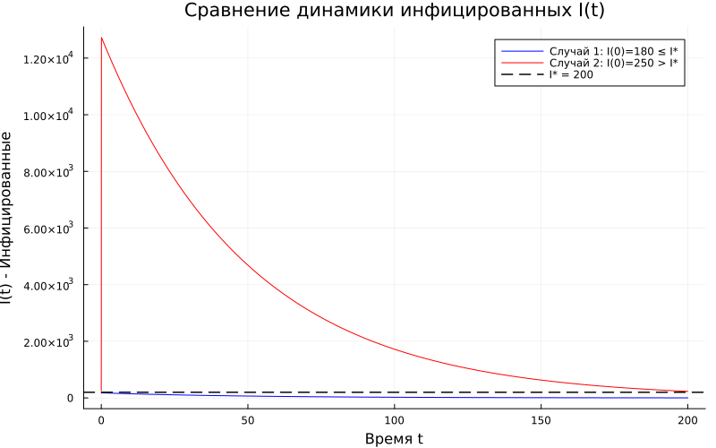

---
## Author
author:
  name: Садова Диана Алексеевна 
  degrees: DSc
  orcid: 0000-0002-0877-7063
  email: 1132239118@rudn.ru
  affiliation:
    - name: Российский университет дружбы народов
      country: Российская Федерация
      postal-code: 117198
      city: Москва
      address: ул. Миклухо-Маклая, д. 6
## Title
title: Задача об эпидемии
subtitle: Лабораторная работа №6
license: CC BY
date: today
date-format: "2026-04-12" # Example: 2025-09-06
---

# Информация

## Докладчик

:::::::::::::: {.columns align=center}
::: {.column width="70%"}

Садова Диана Алексеевна 

студентка 3 курса

Российского университета дружбы народов им. П. Лумумбы

[1132239118@rudn.ru](mailto:1132239118@rudn.ru)

<https://dianasadova.github.io/>

:::
::: {.column width="30%"}


:::
::::::::::::::

# Вводная часть

## Актуальность

- Узнать как строяться и анализируются данные по эпидемиям в мире.

## Цели и задачи

Построить модель эпидемии и провести ее анализ. 

## Материалы и методы

Текст лабороторной работы №6

Интернет для исправления ошибок 

# Задача об эпидемии

## Вариант 39

На одном острове вспыхнула эпидемия. Известно, что из всех проживающих на острове (N=12 800) в момент начала эпидемии (t=0) число заболевших людей (являющихся распространителями инфекции) I(0)=180, А число здоровых людей с иммунитетом к болезни R(0)=58. Таким образом, число людей восприимчивых к болезни, но пока здоровых, в начальный момент времени S(0)=N-I(0)- R(0). Постройте графики изменения числа особей в каждой из трех групп.

##

Рассмотрите, как будет протекать эпидемия в случае:

*1.* если I0 <= I*

*2.* если I0 > I*

## Код

Параметры:

```yaml

N = 12800
I0 = 180
R0 = 58
S0 = N - I0 - R0
dt = 0.01
t_span = (0, 200)
α = 0.01
β = 0.02
I_star = 200

```

## Задача об эпидемии. Если I <= I*

```make

function model1!(du, u, p, t)
    S, I, R = u
    α, β = p

    du[1] = 0
    du[2] = -β * I
    du[3] = β * I
end

```

## Задача об эпидемии Если I > I*

```make

I0_case2 = 250
S0_case2 = N - I0_case2 - R0

function model2!(du, u, p, t)
    S, I, R = u
    α, β = p

    if I > I_star

        du[1] = -α * S * I
        du[2] = α * S * I - β * I
    else

        du[1] = 0.0
        du[2] = -β * I
    end
    du[3] = β * I
end

```

## Результаты кода 

{#fig-001 width=70%}

##

{#fig-002 width=70%}

##

{#fig-003 width=70%}

## Результаты

Построили модель эпидемии и провели ее анализ. 
