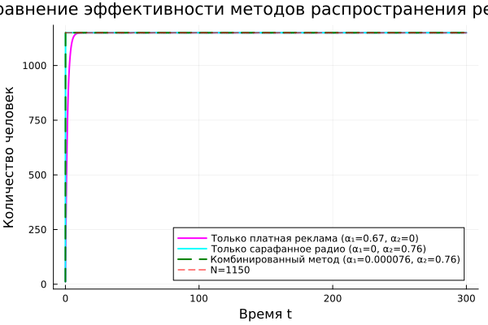

---
## Author
author:
  name: Садова Диана Алексеевна 
  degrees: DSc
  orcid: 0000-0002-0877-7063
  email: 1132239118@rudn.ru
  affiliation:
    - name: Российский университет дружбы народов
      country: Российская Федерация
      postal-code: 117198
      city: Москва
      address: ул. Миклухо-Маклая, д. 6
## Title
title: Эффективность рекламы
subtitle: Лабораторная работа №7
license: CC BY
date: today
date-format: "2026-05-04" # Example: 2025-09-06
---

# Информация

## Докладчик

:::::::::::::: {.columns align=center}
::: {.column width="70%"}

Садова Диана Алексеевна 

студентка 3 курса

Российского университета дружбы народов им. П. Лумумбы

[1132239118@rudn.ru](mailto:1132239118@rudn.ru)

<https://dianasadova.github.io/>

:::
::: {.column width="30%"}


:::
::::::::::::::

# Вводная часть

## Актуальность

- Узнать как анализируется эфективность рекламы для небольшого бизнеса. 

## Цели и задачи

Построить модель "Эфективности рекламмы" на предложенных примерах.

## Материалы и методы

Текст лабороторной работы №7

Интернет для исправления ошибок 

# Задача об эпидемии

## Вариант 39

29 января в городе открылся новый салон красоты. Полагаем, что на момент открытия о салоне знали n(12) потенциальных клиентов. По маркетинговым исследованиям известно, что в районе проживают N(1150) потенциальных клиентов салона. Поэтому после открытия салона руководитель запускает активную рекламную компанию. После этого скорость изменения числа знающих о салоне пропорциональна как числу знающих о нем, так и числу не знаю о нем.

##

*1.* Построить график распространения рекламы о салоне красоты (n и N).

*2.* Сравнить эффективность рекламной кампании при a1(t) > a2(t), a1(t) < a2(t).

*3.* Определить в какой момент времени эффективность рекламы будет иметь максимально быстрый рост (на вашем примере).

*4.* Построить решение, если учитывать вклад только платной рекламы

*5.* Построить решение, если предположить, что информация о товаре распространятся только путем «сарафанного радио», сравнить оба решения

##

Постройте график распространения рекламы, математическая модель которой описывается
следующим уравнением. При этом объем аудитории 1150 = N  , в начальный момент о товаре знает 12 = n человек. Для случая 2 определите в какой момент времени скорость распространения рекламы будет иметь максимальное значение.

##


## Код

Параметры:

```yaml

N = 1150
n0 = 12.0

dt = 0.1
t_span = (0.0, 300.0)

```

## Модель 1: α₁ = 0.67, α₂ = 0.000067

```make

function model1!(du, u, p, t)
    n = u[1]
    a1 = 0.67
    a2 = 0.000067
    du[1] = (a1 + a2 * n) * (N - n)
end

```

## Модель 2: α₁ = 0.000076, α₂ = 0.76

```make

function model2!(du, u, p, t)
    n = u[1]
    a1 = 0.000076
    a2 = 0.76
    du[1] = (a1 + a2 * n) * (N - n)
end

```
## Расчет скорости распространения для модели 2. Нахождение максимальной скорости

```make

v2 = @. (0.000076 + 0.76 * n2) * (N - n2)

v_max, idx_max = findmax(v2)
t_max = t2[idx_max]
n_at_max = n2[idx_max]

```

## Модель 3: α₁ = 0.76·sin(t), α₂ = 0.67·cos(t)

```make

function model3!(du, u, p, t)
    n = u[1]
    a1 = 0.76 * sin(t)
    a2 = 0.67 * cos(t)
    du[1] = (a1 + a2 * n) * (N - n)
end

```

## Результаты кода 


{#fig-002 width=70%}

##

{#fig-003 width=70%}

##

{#fig-004 width=70%}

##

{#fig-005 width=70%}

##

{#fig-006 width=70%}

##

{#fig-007 width=70%}

## Результаты

Построили модель "Эфективности рекламмы" и провели ее анализ. 
