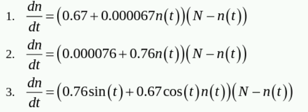
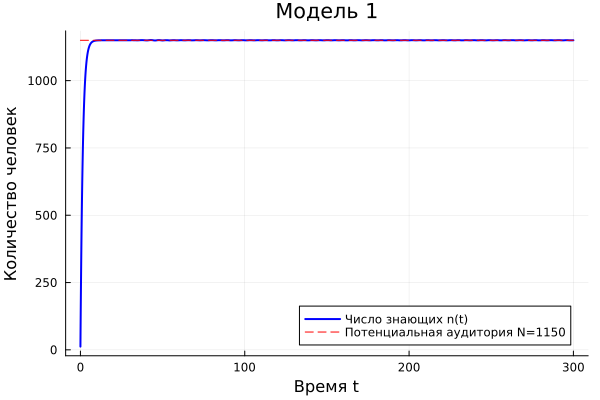
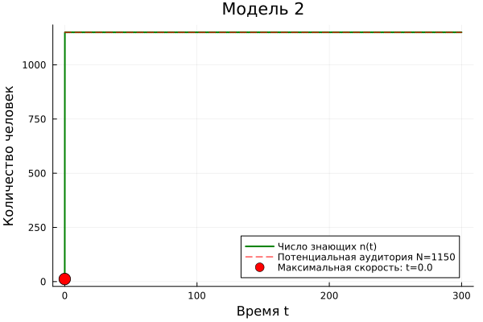
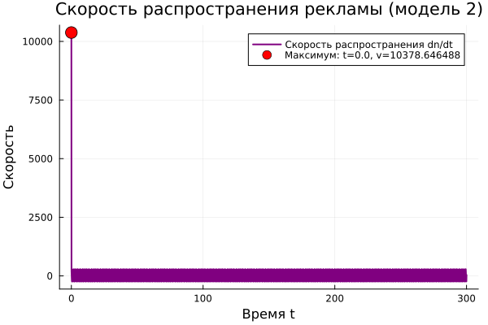
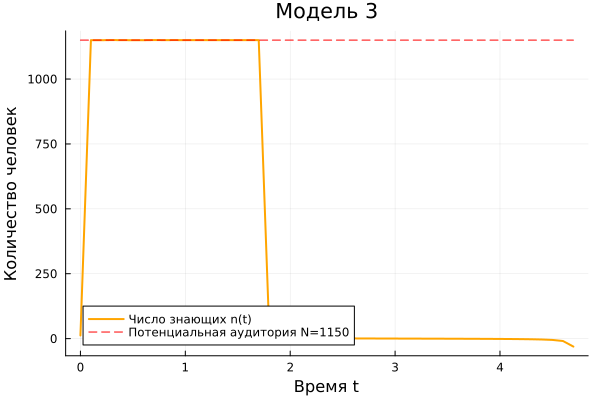
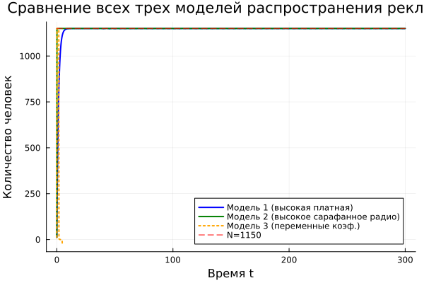
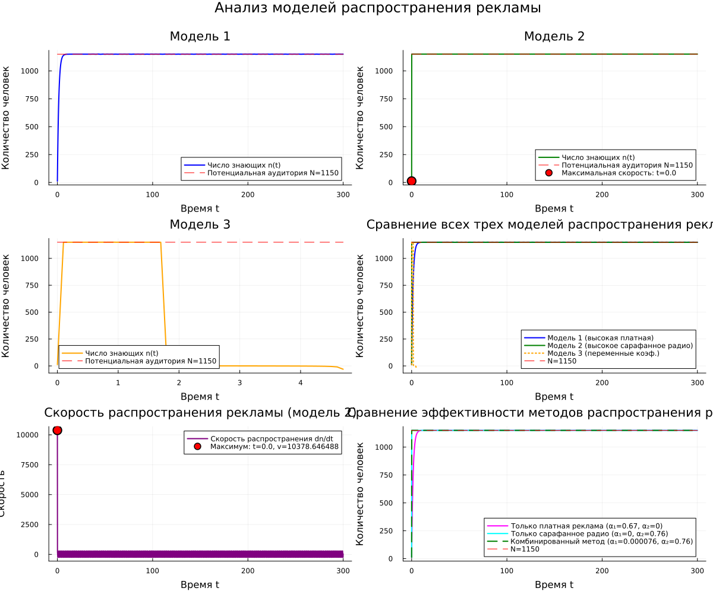

---
## Author
author:
  name: Садова Диана Алексеевна 
  degrees: DSc
  orcid: 0000-0002-0877-7063
  email: 1132239118@rudn.ru
  affiliation:
    - name: Российский университет дружбы народов
      country: Российская Федерация
      postal-code: 117198
      city: Москва
      address: ул. Миклухо-Маклая, д. 6

## Title
title: "Эффективность рекламы"
subtitle: "Лабораторная работа №7"
license: "CC BY"
---

# Цель работы

Построить модель "Эфективности рекламмы" на предложенных примерах.

# Задание. Вариант 39

29 января в городе открылся новый салон красоты. Полагаем, что на момент открытия о салоне знали n(12) потенциальных клиентов. По маркетинговым исследованиям известно, что в районе проживают N(1150) потенциальных клиентов салона. Поэтому после открытия салона руководитель запускает активную рекламную компанию. После этого скорость изменения числа знающих о салоне пропорциональна как числу знающих о нем, так и числу не знаю о нем.

*1.* Построить график распространения рекламы о салоне красоты (n и N).

*2.* Сравнить эффективность рекламной кампании при a1(t) > a2(t), a1(t) < a2(t).

*3.* Определить в какой момент времени эффективность рекламы будет иметь максимально быстрый рост (на вашем примере).

*4.* Построить решение, если учитывать вклад только платной рекламы

*5.* Построить решение, если предположить, что информация о товаре распространятся только путем «сарафанного радио», сравнить оба решения

Постройте график распространения рекламы, математическая модель которой описывается
следующим уравнением: ([рис. @fig-001]).

{#fig-001 width=90%}

При этом объем аудитории 1150 = N  , в начальный момент о товаре знает 12 = n человек. Для случая 2 определите в какой момент времени скорость распространения рекламы будет иметь максимальное значение.

# Выполнение лабораторной работы



 ([рис. @fig-002]),  ([рис. @fig-003]),  ([рис. @fig-004]),  ([рис. @fig-005]),  ([рис. @fig-006]), ([рис. @fig-007]),  ([рис. @fig-008]).

{#fig-002 width=90%}

{#fig-003 width=90%}

{#fig-004 width=90%}

{#fig-005 width=90%}

{#fig-006 width=90%}

{#fig-007 width=90%}

{#fig-008 width=90%}

# Выводы

Построили модель "Эфективности рекламмы" и провели ее анализ. 

# Список литературы{.unnumbered}

::: {#refs}
:::
