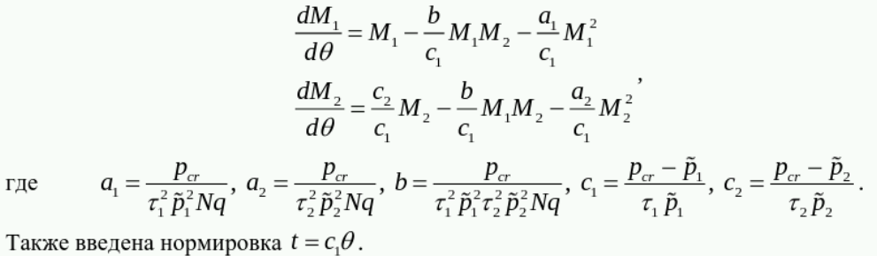
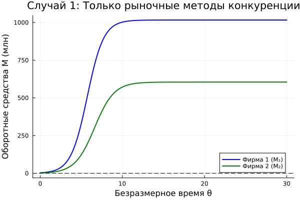
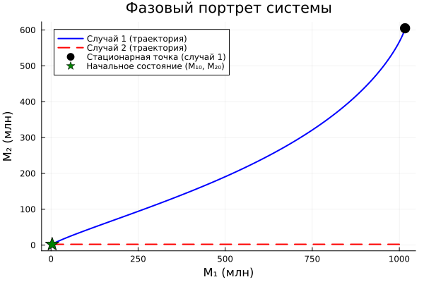

---
## Author
author:
  name: Садова Диана Алексеевна 
  degrees: DSc
  orcid: 0000-0002-0877-7063
  email: 1132239118@rudn.ru
  affiliation:
    - name: Российский университет дружбы народов
      country: Российская Федерация
      postal-code: 117198
      city: Москва
      address: ул. Миклухо-Маклая, д. 6
## Title
title: Модель конкуренции двух фирм
subtitle: Лабораторная работа №8
license: CC BY
date: today
date-format: "2026-05-04" # Example: 2025-09-06
---

# Информация

## Докладчик

:::::::::::::: {.columns align=center}
::: {.column width="70%"}

Садова Диана Алексеевна 

студентка 3 курса

Российского университета дружбы народов им. П. Лумумбы

[1132239118@rudn.ru](mailto:1132239118@rudn.ru)

<https://dianasadova.github.io/>

:::
::: {.column width="30%"}


:::
::::::::::::::

# Вводная часть

## Актуальность

- Узнать как строяться прогнозы конкуренции между крупными фирмами. 

## Цели и задачи

Построить модель "Модель конкуренции двух фирм" на предложенных примерах и проанализировать ее. 

## Материалы и методы

Текст лабороторной работы №8

Интернет для исправления ошибок 

# Задание. Вариант 39

**Случай 1.** Рассмотрим две фирмы, производящие взаимозаменяемые товары одинакового качества и находящиеся в одной рыночной нише. Считаем, что в рамках нашей модели конкурентная борьба ведётся только рыночными методами. То есть, конкуренты могут влиять на противника путем изменения параметров своего производства: себестоимость, время цикла, но не могут прямо вмешиваться в ситуацию на рынке («назначать» цену или влиять на потребителей каким-либо иным способом.) Будем считать, что постоянные издержки пренебрежимо малы, и в модели учитывать не будем. В этом случае динамика изменения объемов продаж фирмы 1 и фирмы 2 описывается следующей системой уравнений:

##

{#fig-001 width=70%}

##

**Случай 2.** Рассмотрим модель, когда, помимо экономического фактора влияния (изменение себестоимости, производственного цикла, использование кредита и т.п.), используются еще и социально-психологические факторы – формирование общественного предпочтения одного товара другому, не зависимо от их качества и цены. В этом случае взаимодействие двух фирм будет зависеть друг от друга, соответственно коэффициент перед1 2M M будет отличаться. Пусть в рамках рассматриваемой модели динамика изменения объемов продаж фирмы 1 и фирмы 2 описывается следующей системой уравнений:

##

{#fig-002 width=70%}

##

Обозначения:

N – число потребителей производимого продукта.

τ – длительность производственного цикла

p – рыночная цена товара

p̃ – себестоимость продукта, то есть переменные издержки на производство единицы продукции.

q – максимальная потребность одного человека в продукте в единицу времени

t - безразмерное время

## Задание

*1.* Постройте графики изменения оборотных средств фирмы 1 и фирмы 2 без учета постоянных издержек и с веденной нормировкой для случая 1.

*2.* Постройте графики изменения оборотных средств фирмы 1 и фирмы 2 без учета постоянных издержек и с веденной нормировкой для случая 2.

## Код

Параметры:

```yaml

M01 = 3.3
M02 = 2.3
N = 33
p_cr = 22
tau1 = 22
p1 = 6.6
tau2 = 11
p2 = 11.1
V = 10
q = 1

dt = 0.01
t_span = (0.0, 30.0)

```
## 

```make
a1 = p_cr/(tau1*tau1*p1*p1*V*q);
a2 = p_cr/(tau2*tau2*p2*p2*V*q);
b = p_cr/(tau1*tau1*tau2*tau2*p1*p1*p2*p2*V*q);
c1 = (p_cr-p1)/(tau1*p1);
c2 = (p_cr-p2)/(tau2*p2);

```

## Модель 1

```make

function case1!(du, u, p, 0)
    M1, M2 = u

    du[1] = (c1/c1)*M1 - (a1/c1)*M1^2 - (b/c1)*M1*M2
    du[2] = (c2/c1)*M2 - (a2/c1)*M2^2 - (b/c1)*M1*M2
end

```

## Модель 2

```make

function case2!(du, u, p, 0)
    M1, M2 = u
    du[1] = (c1/c1)*M1 - (a1/c1)*M1^2 - (b/c1)*M1*M2
    du[2] = 0.00093*M2 - (a2/c1)*M2^2 - (b/c1)*M1*M2
end


```

## Результаты кода 

{#fig-003 width=70%}

##

{#fig-004 width=70%}

##

{#fig-005 width=70%}

##

{#fig-006 width=70%}

## Результаты

Граничные стационарные состояния:

*1.* (M₁, M₂) = (0, 0) - тривиальное, неустойчивое

*2.* (M₁, M₂) = (0, 604.95) - фирма 1 отсутствует

*3.* (M₁, M₂) = (1016.4, 0) - фирма 2 отсутствует


# Выводы

Построили модель "Модель конкуренции двух фирм" на предложенных примерах и проанализировали ее. 

