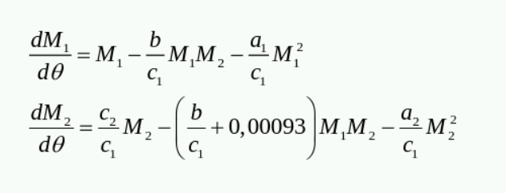
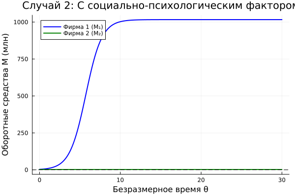
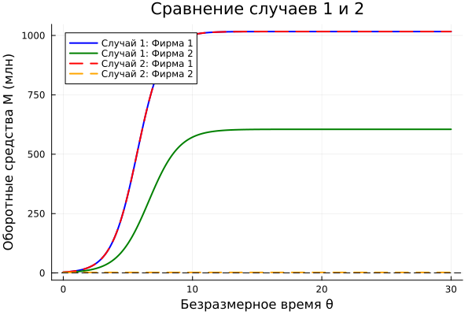
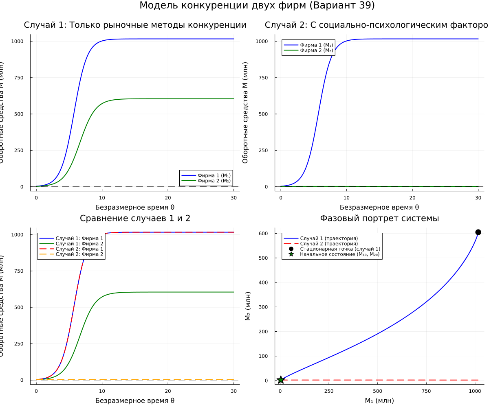

---
## Author
author:
  name: Садова Диана Алексеевна 
  degrees: DSc
  orcid: 0000-0002-0877-7063
  email: 1132239118@rudn.ru
  affiliation:
    - name: Российский университет дружбы народов
      country: Российская Федерация
      postal-code: 117198
      city: Москва
      address: ул. Миклухо-Маклая, д. 6

## Title
title: "Модель конкуренции двух фирм"
subtitle: "Лабораторная работа №8"
license: "CC BY"
---

# Цель работы

Построить модель "Модель конкуренции двух фирм" на предложенных примерах и проанализировать ее. 

# Задание. Вариант 39

**Случай 1.** Рассмотрим две фирмы, производящие взаимозаменяемые товары одинакового качества и находящиеся в одной рыночной нише. Считаем, что в рамках нашей модели конкурентная борьба ведётся только рыночными методами. То есть, конкуренты могут влиять на противника путем изменения параметров своего производства: себестоимость, время цикла, но не могут прямо вмешиваться в ситуацию на рынке («назначать» цену или влиять на потребителей каким-либо иным способом.) Будем считать, что постоянные издержки пренебрежимо малы, и в модели учитывать не будем. В этом случае динамика изменения объемов продаж фирмы 1 и фирмы 2 описывается следующей системой уравнений:([рис. @fig-001]).

{#fig-001 width=90%}

**Случай 2.** Рассмотрим модель, когда, помимо экономического фактора влияния (изменение себестоимости, производственного цикла, использование кредита и т.п.), используются еще и социально-психологические факторы – формирование общественного предпочтения одного товара другому, не зависимо от их качества и цены. В этом случае взаимодействие двух фирм будет зависеть друг от друга, соответственно коэффициент перед1 2M M будет отличаться. Пусть в рамках рассматриваемой модели динамика изменения объемов продаж фирмы 1 и фирмы 2 описывается следующей системой уравнений:([рис. @fig-002]).

{#fig-002 width=90%}

Обозначения:

N – число потребителей производимого продукта.

τ – длительность производственного цикла

p – рыночная цена товара

p̃ – себестоимость продукта, то есть переменные издержки на производство единицы продукции.

q – максимальная потребность одного человека в продукте в единицу времени

t - безразмерное время

*1.* Постройте графики изменения оборотных средств фирмы 1 и фирмы 2 без учета постоянных издержек и с веденной нормировкой для случая 1.

*2.* Постройте графики изменения оборотных средств фирмы 1 и фирмы 2 без учета постоянных издержек и с веденной нормировкой для случая 2.

# Выполнение лабораторной работы



([рис. @fig-003]),  ([рис. @fig-004]),  ([рис. @fig-005]),  ([рис. @fig-006]), ([рис. @fig-007]).

{#fig-003 width=90%}

{#fig-004 width=90%}

{#fig-005 width=90%}

{#fig-006 width=90%}

{#fig-007 width=90%}

# Выводы

Построили модель "Модель конкуренции двух фирм" на предложенных примерах и проанализировали ее. 

# Список литературы{.unnumbered}

::: {#refs}
:::
