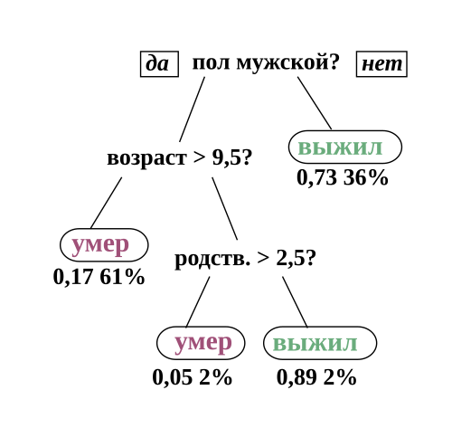
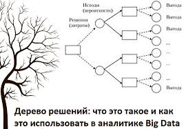
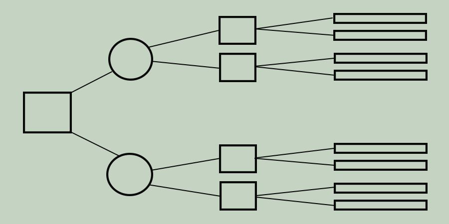
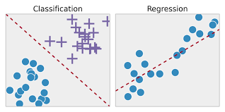

---
## Author
author:
  name: Садова Диана Алексеевна 
  degrees: DSc
  orcid: 0000-0002-0877-7063
  email: 1132239118@rudn.ru
  affiliation:
    - name: Российский университет дружбы народов
      country: Российская Федерация
      postal-code: 117198
      city: Москва
      address: ул. Миклухо-Маклая, д. 6
      
## Title
title: Дерево решений
subtitle: Доклад
license: CC BY
date: today
date-format: "2026-03-04" 

## i18n babel
babel-lang: russian
babel-otherlangs: english
## Fonts
mainfont: PT Serif
romanfont: PT Serif
sansfont: PT Sans
monofont: PT Mono
mainfontoptions: Ligatures=TeX
romanfontoptions: Ligatures=TeX
sansfontoptions: Ligatures=TeX,Scale=MatchLowercase
monofontoptions: Scale=MatchLowercase,Scale=0.9

---

# Информация

## Информация о докладчике

:::::::::::::: {.columns align=center}
::: {.column width="70%"}

 Садова Диана Алексеевна
 
 студент бакалавриата
 
 Российский университет дружбы народов
 
 [113229118@pfur.ru]
 
 <https://DianaSadova.github.io/ru/>
  
:::
::: {.column width="30%"}

:::
::::::::::::::

# Вводная часть

## Актуальность

 В современном мире практически любая сфера связана с анализом данных нуждается в учтении множество факторов. 

## Объект и предмет исследования

Процессы анализа данных и поддержки принятия решений.

Метод «Дерево решений» как инструмент классификации и регрессии.

## Цели и задачи

 Метод «Дерево решений» как один из ключевых инструментов анализа данных и поддержки принятия решений. 

## Материалы и методы

 Просторы интернета 
 
 Знания с занятий "Обработка больших данных с использованием машинного обучения"

# Что такое дерево решений?

:::::::::::::: {.columns align=center}
::: {.column width="50%"}

Дерево решений — это метод статистики и анализа данных.

Его основная цель — создать модель, способную предсказывать значение целевой переменной на основе нескольких входных признаков. 

:::
::: {.column width="50%"}

:::
::::::::::::::

## Структура 

:::::::::::::: {.columns align=center}
::: {.column width="50%"}

Структура дерева напоминает обычное дерево, перевёрнутое вверх корнем. 

Чтобы классифицировать новый объект, необходимо начать с корневого узла и последовательно двигаться по ветвям, проверяя условия. 

:::
::: {.column width="50%"}

:::
::::::::::::::

## Построение

:::::::::::::: {.columns align=center}
::: {.column width="50%"}
 
Узлы решения (Decision nodes)

Вероятностные узлы (Chance nodes) 

Замыкающие узлы (End nodes / Leaves) 

:::
::: {.column width="50%"}

:::
::::::::::::::

## Где применяется?

:::::::::::::: {.columns align=center}
::: {.column width="50%"}

Задачи классификации - Модель определяет принадлежность объекта к определённому классу.

Задачи регрессии - Модель предсказывает числовое значение.

:::
::: {.column width="50%"}

:::
::::::::::::::

## Приимущество

Наглядность и интерпретируемость (White-box model)

Универсальность

Непараметричность

## Недостатки

Склонность к переобучению 

Неустойчивость (High variance)

Смещение в пользу признаков с большим числом значений

# Выводы

В заключение можно сказать, что дерево решений — это эффективный и понятный инструмент моделирования, который помогает анализировать сложные ситуации и принимать обоснованные решения на основе данных.

# Список литературы{.unnumbered}

Дерево решений // Википедия. Свободная энциклопедия. — URL: https://ru.wikipedia.org/wiki/%D0%94%D0%B5%D1%80%D0%B5%D0%B2%D0%BE_%D1%80%D0%B5%D1%88%D0%B5%D0%BD%D0%B8%D0%B9 (дата обращения: 04.03.2026).

Обучение дерева решений // Википедия. - URL: https://ru.wikipedia.org/wiki/%D0%9E%D0%B1%D1%83%D1%87%D0%B5%D0%BD%D0%B8%D0%B5_%D0%B4%D0%B5%D1%80%D0%B5%D0%B2%D0%B0_%D1%80%D0%B5%D1%88%D0%B5%D0%BD%D0%B8%D0%B9 (дата обращения: 04.03.2026).

:::
